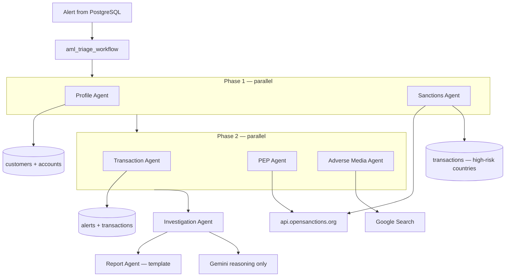
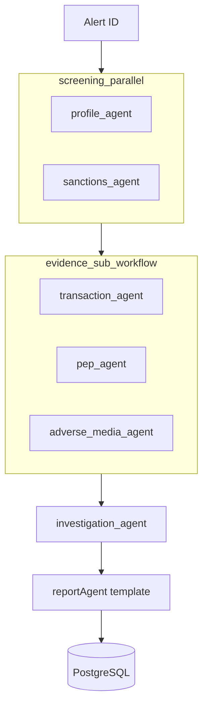

# AML Alert Triage — Google ADK Agent Guide

This document describes how **AML Shield** uses the [Google Agent Development Kit (ADK)](https://adk.dev/) for Gemini-powered AML alert triage.

## Table of Contents

1. [Installation & Setup](#installation--setup)
2. [Core Concepts](#core-concepts)
3. [Project Structure](#project-structure)
4. [FunctionTools](#functiontools)
5. [LlmAgents](#llmagents)
6. [Workflows](#workflows)
7. [API Integration](#api-integration)
8. [Environment Variables](#environment-variables)
9. [Disposition Rules](#disposition-rules)

---

## Installation & Setup

From the monorepo root:

```bash
cd backend
npm install
```

Dependencies include `@google/adk` and `zod`. Set your Gemini API key in `backend/.env`:

```env
GEMINI_API_KEY=your_gemini_api_key
```

`GOOGLE_API_KEY` is also accepted as a fallback alias.

**Requirements:** Node.js 18+ (Node 24+ recommended per ADK docs), PostgreSQL.

```bash
npm run db:setup
npm run dev
```

Frontend (separate terminal):

```bash
cd frontend
npm run dev
```

The Vite dev server proxies `/api` to the backend (default `http://localhost:3002` — check `frontend/vite.config.ts`).

---

## Core Concepts

| Concept | Description |
|---------|-------------|
| `LlmAgent` | Single agent backed by `gemini-flash-latest` with optional tools |
| `FunctionTool` | Zod-typed function the LLM can call (wraps DB queries and external APIs) |
| `ParallelAgent` | Runs sub-agents concurrently in isolated branches |
| `SequentialAgent` | Runs sub-agents one after another |
| `InMemoryRunner` | Executes agents for server-side investigation runs |

> **Note:** ADK also supports graph-based `Workflow` with `edges` arrays (ADK 2.0+). This project uses `ParallelAgent` + `SequentialAgent` workflow agents, which map cleanly to the AML pipeline.

---

## Project Structure

```
backend/src/adk/
├── agents/
│   ├── profileAgent.ts          # Customer KYC (DB: customer_analysis)
│   ├── transactionAgent.ts      # Transaction patterns
│   ├── pepAgent.ts              # PEP screening
│   ├── adverseMediaAgent.ts     # Adverse media (DB: media_analysis)
│   ├── sanctionsAgent.ts        # Sanctions screening
│   └── investigationAgent.ts    # Synthesis + disposition
├── tools/
│   ├── customerLookupTool.ts    # PostgreSQL KYC data
│   ├── transactionAnalysisTool.ts
│   ├── opensanctionsTool.ts     # OpenSanctions API + mock fallback
│   └── adverseMediaTool.ts      # Internal media DB fallback
├── workflows/
│   ├── evidenceSubWorkflow.ts   # ParallelAgent: tx + PEP + media
│   └── amlWorkflow.ts           # SequentialAgent root workflow
├── types.ts
├── utils.ts                     # runAdkAgent, JSON parsing
└── runner.ts                    # runAmlTriage(), API bridge
```

Legacy rule-based agents remain in `backend/src/services/agents/` as fallbacks when `GEMINI_API_KEY` is unset or ADK calls fail.

---

## FunctionTools

Tools use `FunctionTool` with Zod schemas (not plain JSON-schema `Tool` objects):

```typescript
import { FunctionTool } from '@google/adk';
import { z } from 'zod';

export const customerLookupTool = new FunctionTool({
  name: 'customer_lookup',
  description: 'Retrieve customer KYC from the bank database.',
  parameters: z.object({
    customer_id: z.number(),
  }),
  execute: async ({ customer_id }) => customerAgent.analyze(customer_id),
});
```

| Tool | Data source |
|------|-------------|
| `customer_lookup` | PostgreSQL — customers, accounts |
| `transaction_analysis` | PostgreSQL — alerts, transactions |
| `opensanctions_lookup` | OpenSanctions API (live when `USE_MOCK_SCREENING=false`) |
| Adverse media (live) | ADK `GOOGLE_SEARCH` — no separate key |

---

## How Each Agent Works (Data Sources & Search)

When you click **Start AI Investigation**, the workflow runs in this order. Each row shows **what Gemini does** vs **where real data comes from**.



### 1. Profile Agent (`profile_agent` → `customer_analysis`)

| | |
|---|---|
| **Role** | Customer due-diligence — who is this customer? |
| **LLM** | Gemini reads tool output and writes JSON summary + risk signals |
| **Tool** | `customer_lookup` |
| **Data source** | **PostgreSQL only** |
| **Tables** | `customers`, `accounts` |
| **What it fetches** | Name, PAN, occupation, country, `is_pep`, risk score/category, account age, account count, total balance |
| **API key** | None for DB; Gemini uses `GEMINI_API_KEY` |

**Flow:** Alert has `customer_id` → Gemini calls `customer_lookup(customer_id)` → tool runs `customerAgent.analyze()` → SQL queries → Gemini formats JSON.

**Example signal:** *"Account opened 45 days ago, High risk category, occupation: Import Trader"*

---

### 2. Transaction Agent (`transaction_agent` → `transaction_analysis`)

| | |
|---|---|
| **Role** | Is the flagged payment unusual vs this customer's history? |
| **LLM** | Gemini interprets patterns (spike, velocity, structuring) |
| **Tool** | `transaction_analysis` |
| **Data source** | **PostgreSQL only** |
| **Tables** | `alerts`, `transactions`, `accounts` |
| **What it fetches** | Alert's linked transaction, last 30 days of txns, monthly average, spike multiplier, velocity (Normal / Elevated / High Frequency) |
| **API key** | None for DB; Gemini uses `GEMINI_API_KEY` |

**Flow:** Gemini calls `transaction_analysis(alert_id, customer_id)` → compares trigger amount to historical average → returns risk Low/Medium/High.

**Example signal:** *"₹18.5L transfer is 25× monthly average — High risk"*

---

### 3. Sanctions Agent (`sanctions_agent` → `sanctions_check`)

| | |
|---|---|
| **Role** | Is the customer on a sanctions list or linked to high-risk geography? |
| **LLM** | Gemini calls tool and maps API + DB results to `sanctionMatch`, `matchedLists` |
| **Tool** | `opensanctions_lookup` with `check_type: "sanctions"` |
| **External search** | **https://api.opensanctions.org/match/default** |
| **Lists searched** | OFAC, UN, EU, and other datasets in OpenSanctions (live API) |
| **Also checks (DB)** | Count of customer transactions where `country` is in `HIGH_RISK_COUNTRIES` (Iran, North Korea, Syria, Afghanistan, Yemen) |
| **API key** | OpenSanctions = **no key**; Gemini = `GEMINI_API_KEY` |

**Flow:**
1. Gemini gets customer name from alert context
2. Calls `opensanctions_lookup(entity_name, "sanctions", customer_id)`
3. Tool POSTs name to OpenSanctions → returns match score + dataset names
4. Tool counts Iran/Syria/etc. transactions from PostgreSQL
5. Gemini returns JSON with `sanctionMatch`, `highRiskCountryTransactions`

**Example signal:** *"OpenSanctions match on OFAC dataset; 2 transactions to Iran"*

---

### 4. PEP Agent (`pep_agent` → `pep_check`)

| | |
|---|---|
| **Role** | Is the customer a Politically Exposed Person? |
| **LLM** | Gemini interprets OpenSanctions PEP datasets + KYC flag |
| **Tool** | `opensanctions_lookup` with `check_type: "pep"` |
| **External search** | **https://api.opensanctions.org/match/default** (PEP-related datasets) |
| **Also checks (DB)** | `customers.is_pep` from KYC onboarding |
| **API key** | OpenSanctions = **no key**; Gemini = `GEMINI_API_KEY` |

**Flow:** Same API as sanctions agent, different `check_type`. Gemini also sees `is_kyc_pep` from the database.

**Example signal:** *"PEP match: government official; KYC flag is_pep=true"*

---

### 5. Adverse Media Agent (`adverse_media_agent` → `media_analysis`)

| | |
|---|---|
| **Role** | Any negative news about the customer? |
| **LLM** | Gemini runs web search and summarises articles |
| **Tool** | `GOOGLE_SEARCH` (built-in ADK tool) |
| **External search** | **Google Search** via Gemini (query: name + "fraud" / "money laundering" / etc.) |
| **API key** | Same `GOOGLE_API_KEY` / `GEMINI_API_KEY` |
| **Mock mode** | If `USE_MOCK_SCREENING=true`, uses empty mock tool instead |

**Flow:** Gemini searches the public web → extracts article titles, URLs, sentiment → returns `negativeNews`, `articleCount`, `articles[]`.

**Example signal:** *"3 adverse articles: fraud investigation, tax scrutiny"*

---

### 6. Investigation Agent (`investigation_agent` → `investigation` + `decision`)

| | |
|---|---|
| **Role** | Senior analyst — combine all findings, write narrative, decide CLEAR / ESCALATE / SAR |
| **LLM** | Gemini only — **no tools** |
| **Input** | JSON findings from all 5 agents above (via workflow session) |
| **Output** | Narrative, `overall_risk_score`, `disposition`, `confidence`, `reasoning[]` |
| **Rules** | Sanctions match → SAR; confidence &lt; 0.65 → ESCALATE |

---

### 7. Report Agent (`report` — not LLM)

| | |
|---|---|
| **Role** | Compliance report text for auditors |
| **Implementation** | `reportAgent.ts` — **fixed template**, no Gemini |
| **Input** | All agent JSON results |
| **Output** | Multi-section text report saved to `investigations.report_summary` |

---

## Agent Summary Table

| # | Agent | Searches / reads | External API? |
|---|-------|------------------|---------------|
| 1 | Profile | PostgreSQL `customers`, `accounts` | No |
| 2 | Transaction | PostgreSQL `alerts`, `transactions` | No |
| 3 | Sanctions | OpenSanctions + PostgreSQL txn countries | **Yes** — opensanctions.org |
| 4 | PEP | OpenSanctions PEP + PostgreSQL `is_pep` | **Yes** — opensanctions.org |
| 5 | Adverse Media | Google Search | **Yes** — Google (via Gemini) |
| 6 | Investigation | Prior agent outputs only | Gemini only |
| 7 | Report | Template merge | No |

**All Gemini agents share one key:** `GEMINI_API_KEY` or `GOOGLE_API_KEY` in `backend/.env`.

---

## LlmAgents

All specialist agents use `model: 'gemini-flash-latest'` and return structured JSON.

| ADK agent | DB `agent_type` | Tools |
|-----------|-----------------|-------|
| `profile_agent` | `customer_analysis` | `customer_lookup` |
| `transaction_agent` | `transaction_analysis` | `transaction_analysis` |
| `sanctions_agent` | `sanctions_check` | `opensanctions_lookup` |
| `pep_agent` | `pep_check` | `opensanctions_lookup` |
| `adverse_media_agent` | `media_analysis` | `GOOGLE_SEARCH`, `adverse_media_lookup` |
| `investigation_agent` | `investigation` + `decision` | none (synthesizes prior findings) |

The **Report Agent** (`report`) is deterministic template generation in `reportAgent.ts` — not an LLM agent.

---

## Workflows



**Runtime execution** (`runner.ts`): `runAmlWorkflow()` executes `aml_triage_workflow` via ADK `Runner` + session state; `reportAgent` generates the final narrative.

Workflow definitions in `workflows/` use ADK `ParallelAgent` and `SequentialAgent` for structure and testing with `npx adk run`.

---

## API Integration

| Method | Endpoint | Description |
|--------|----------|-------------|
| POST | `/api/investigations/start/:alertId` | Full ADK pipeline via `orchestrator.ts` |
| POST | `/api/agents/customer-analysis` | Single profile agent |
| POST | `/api/agents/transaction-analysis` | Single transaction agent |
| POST | `/api/agents/sanctions-check` | Single sanctions agent |
| POST | `/api/agents/pep-check` | Single PEP agent |
| POST | `/api/agents/media-analysis` | Single adverse media agent |
| POST | `/api/agents/final-decision` | Full triage, returns disposition only |

All agent endpoints require JWT auth (`bank_manager` or `admin` role) and `alertId` in the request body.

Investigation results are persisted to `investigations`, `agent_results` (8 rows), `alert_evidence`, and optionally `cases` / `sar_reports`.

---

## Environment Variables

See [`backend/.env.example`](../backend/.env.example).

| Variable | Purpose |
|----------|---------|
| `GEMINI_API_KEY` | Gemini API key for ADK agents |
| `GOOGLE_API_KEY` | Alias for `GEMINI_API_KEY` |
| `USE_MOCK_SCREENING` | `true` = skip OpenSanctions/Google Search, use seeded data |
| `DATABASE_URL` | PostgreSQL connection |
| `JWT_SECRET` | Auth token signing |
| `HIGH_RISK_COUNTRIES` | Comma-separated country list for sanctions geography checks |

---

## Disposition Rules

The investigation agent (`investigation_agent`) applies these rules:

| Disposition | Condition |
|-------------|-----------|
| **SAR** | Confirmed sanctions match, or strong suspicious-activity evidence |
| **ESCALATE** | Confidence &lt; 0.65, or ambiguous multi-factor risk |
| **CLEAR** | No significant risk indicators |

Disposition values in the database and API are `CLEAR`, `ESCALATE`, or `SAR` (not `FILE_SAR`).

Confidence from the LLM (0–1) is stored and displayed as a percentage (0–100).

---

## Local ADK Testing

With `@google/adk-devtools` installed:

```bash
cd backend
npx adk web
```

Use ADK Web for development debugging only — production investigations run through the Express API.
