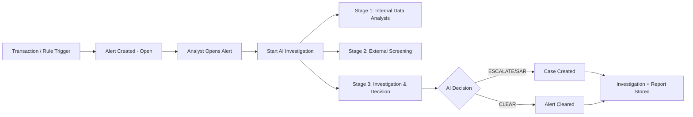

# AML Alert Triage & Investigation System
## Presentation Document

## 1) Executive Summary

The AML Alert Triage & Investigation System is an AI-assisted compliance platform that helps financial institutions investigate suspicious alerts faster and more consistently.  
It combines internal transaction/KYC analysis with external screening (sanctions, PEP, adverse media), then produces a defensible compliance recommendation:

- `CLEAR`
- `ESCALATE`
- `FILE_SAR`

The solution is designed to improve analyst productivity, reduce false positives, and maintain audit-ready investigation records.

---

## 2) Business Problem

Financial crime teams face:

- High alert volumes and manual workload
- Inconsistent investigation quality across analysts
- Slow turnaround times for escalations
- Difficulty maintaining regulator-ready narratives

This application addresses these gaps with a structured, stage-based AI investigation workflow.

---

## 3) Solution Overview

The platform orchestrates AML investigation in three business stages:

1. **Internal Data Analysis**
   - Customer profile, KYC, risk rating, account behavior
   - Transaction anomaly checks (spike, structuring, velocity)

2. **External Screening**
   - Sanctions screening
   - PEP screening
   - Adverse media screening

3. **Investigation & Decision**
   - Correlated risk assessment
   - Compliance narrative generation
   - Final recommendation (`CLEAR | ESCALATE | FILE_SAR`)

The UI intentionally displays stage-level progress instead of technical agent names for business clarity.

### Integrated LLM

The application is integrated with **Google Gemini** via the ADK stack.

- Runtime model used in agent workflows: **`gemini-flash-latest`**
- Integration layer: **`@google/adk`** (LLM agents + tools orchestration)
- API key source: `GOOGLE_API_KEY` (or `GEMINI_API_KEY`)

---

## 4) Key Capabilities

- AI-guided AML alert triage
- End-to-end investigation orchestration
- OpenSanctions and adverse-media integration
- High-risk country detection from database-managed country list
- Confidence-scored decisions and rationale
- Case/SAR workflow support for non-clear outcomes
- Audit-friendly report generation

---

## 5) System Architecture (High Level)

### Frontend

- React + Vite UI
- Alert monitoring, investigation initiation, stage-level tracking
- Investigation report and decision views

### Backend

- Node.js + TypeScript + Express
- Orchestrator service for investigation pipeline
- Rule engine + AI-assisted synthesis
- REST APIs for alerts, investigations, cases, reports

### Data Layer

- PostgreSQL for core entities:
  - customers
  - accounts
  - transactions
  - alerts
  - investigations
  - agent_results
  - cases
  - sar_reports
  - high_risk_countries

### External Intelligence

- OpenSanctions
- Google-based adverse media search

### How the LLM Works in This Application

1. Alert context is prepared from internal database records (customer, account, transaction, alert metadata).
2. Specialized LLM-backed agents run with structured prompts:
   - profile analysis
   - transaction analysis
   - sanctions/PEP checks
   - adverse media checks
3. Agent outputs are normalized into structured JSON objects.
4. Investigation synthesis combines internal + external findings.
5. Decision logic applies AML thresholds/guardrails and produces:
   - risk level
   - confidence score
   - final recommendation (`CLEAR | ESCALATE | FILE_SAR`)
6. A compliance narrative is generated and stored for audit/regulatory review.

Important: the platform uses rule checks plus LLM reasoning together, so decisions remain both explainable and operationally consistent.

---

## 6) Investigation Decision Logic

### Final Outcomes

- **CLEAR**: No significant indicators; activity appears legitimate
- **ESCALATE**: Moderate indicators; manual senior review required
- **FILE_SAR**: Strong indicators of financial crime; regulatory reporting warranted

### Guardrails

- Investigations can run only for alerts in `Open` status
- Re-run prevention for already-processed alerts
- Stage-based status tracking:
  - `NOT_STARTED`
  - `IN_PROGRESS`
  - `COMPLETED`
  - `FAILED`

---

## 7) Data & Compliance Controls

- Evidence-based outputs only (no unsupported assumptions)
- Structured reasoning and key risk indicators included in output
- Centralized high-risk country management via DB table (not `.env`)
- End-to-end persistence of investigation artifacts for auditability
- Professional compliance narrative suitable for regulatory review

---

## 8) Demonstration Flow (Suggested)

Use seeded test alerts and show this live sequence:

1. Open Alerts dashboard
2. Select an `Open` alert
3. Start AI investigation
4. Show 3-stage progress in UI:
   - Internal Data Analysis
   - External Screening
   - Investigation & Decision
5. Review final recommendation and confidence
6. Open detailed report narrative
7. Show restricted re-run behavior for non-open alert statuses

Recommended sample cases:

- **Adverse media fail case**
- **High-risk country transaction fail case**
- One likely clear/false-positive case

---

## 9) Business Value

- Faster turnaround for AML investigations
- Better consistency in compliance decisions
- Reduced analyst fatigue from manual triage
- Improved explainability and audit readiness
- Scalable framework for additional screening signals

---

## 10) Future Enhancements

- Workflow SLA dashboards and analyst productivity metrics
- Advanced entity resolution and network analysis
- Multi-language adverse media summarization
- Model monitoring and drift controls
- Policy versioning and regulator-specific report templates

---

## 11) Conclusion

This application provides a practical, compliance-first AML investigation platform that blends deterministic controls with AI-assisted analysis.  
It enables institutions to investigate faster, document better, and escalate with higher confidence.

---

## 12) Application Presentation Steps (Project Working Flow)

Use this section as a live demo script or slide flow.

### Step 0 — Environment & Login

1. Start backend: `cd backend && npm run dev`
2. Start frontend: `cd frontend && npm run dev`
3. Open `http://localhost:5173`
4. Login with demo credentials:
   - Email: `manager@bank.com`
   - Password: `Manager@123`
5. Confirm system mode shows **Gemini · Live** in sidebar.

**Talking point:** Platform is AI-assisted but evidence-driven and audit-ready.

---

### Step 1 — Dashboard Overview

**Screen:** `/` (Dashboard)

**Show:**
- **Total Alerts** — all alerts in system
- **Open Alerts** — alerts still available for AI investigation (`Open` only)
- **High Risk** — alerts with severity `High` or `Critical`
- **Customers** — total customer profiles
- Alerts table with severity, status, and quick view link

**Talking point:** Dashboard gives compliance team a single operational view before triage.

---

### Step 2 — Alert Monitoring

**Screen:** `/alerts`

**Show:**
- Alert list with code, type, customer, severity, status
- Explain alert statuses:
  - `Open` → eligible for investigation
  - `Escalated` / `Cleared` → already processed

**Talking point:** Alerts are generated by AML rules engine (large txn, structuring, high-risk country, spike, etc.).

---

### Step 3 — Alert Detail Review

**Screen:** `/alerts/:id`

**Show before investigation:**
- Alert summary (severity, risk score, triggered rule)
- Customer KYC profile (occupation, country, PEP flag, risk)
- Related transaction details (amount, country, date)

**Talking point:** Analyst validates context before triggering AI workflow.

---

### Step 4 — Start AI Investigation

**Action:** Click **Start AI Investigation**

**Show modal:**
- Data sources used (PostgreSQL KYC, transactions, OpenSanctions, Google Search)
- **3 business stages** (not 8 technical agents):
  1. Internal Data Analysis
  2. External Screening
  3. Investigation & Decision

**During run:**
- Stage progress animation appears
- Backend orchestrator executes internal agents and aggregates results

**Talking point:** UI shows business stages; technical agents run internally.

---

### Step 5 — AI Pipeline Execution (Backend Flow)

**What happens behind UI:**

1. Load alert + customer + transaction context from DB
2. Run specialist analysis:
   - Customer profile
   - Transaction behavior
   - Sanctions screening (OpenSanctions)
   - PEP screening (OpenSanctions)
   - Adverse media (Google Search)
3. Run investigation synthesis (Gemini)
4. Apply decision rules (`CLEAR | ESCALATE | SAR`)
5. Generate compliance report narrative
6. Persist investigation + agent results
7. Update alert status
8. Create case if decision is not `CLEAR`

**LLM used:** Google Gemini (`gemini-flash-latest`) via `@google/adk`

**Guardrail:** Investigation can run only when alert status is `Open`.

---

### Step 6 — Investigation Result on Alert Page

**Show after completion:**
- Final AI decision badge (`CLEAR`, `ESCALATE`, `SAR`)
- Confidence score
- 3-stage investigation progress summary
- Investigation report narrative
- Link to full investigation record

**Talking point:** Decision is explainable with stored evidence and reasoning.

---

### Step 7 — Investigations Module

**Screen:** `/investigations` and `/investigations/:id`

**Show:**
- Investigation history list
- Investigation detail with:
  - `investigationStatus`
  - 3 stage summaries
  - `finalDecision`, `riskLevel`, `confidenceScore`
  - Full `complianceNarrative`

**Talking point:** Investigations module is the audit record of AI analysis.

---

### Step 8 — Cases Module (Non-CLEAR Outcomes)

**Screen:** `/cases` and `/cases/:id`

**When case appears:**
- AI decision is `ESCALATE` or `SAR`

**Show in case detail:**
- Case number, status, priority
- AI recommendation (read-only)
- Links to related investigation and alert
- Case summary and SAR report section (if SAR decision)

**Talking point:** Cases module stores escalated outcomes for compliance tracking; AI decision is final in current UI flow.

---

### Step 9 — Customers Module

**Screen:** `/customers` and `/customers/:id`

**Show:**
- Customer risk profile and account context
- Linked alert history
- Risk category and score

**Talking point:** Customer 360 view supports ongoing monitoring beyond single alert triage.

---

### Step 10 — Recommended Demo Scenarios

Use seeded pipeline alerts (`ALT-A001` to `ALT-A008`):

| Alert | Scenario | Expected Outcome |
|-------|----------|------------------|
| ALT-A001 | High-risk customer profile | ESCALATE |
| ALT-A002 | Large transaction spike | ESCALATE / SAR |
| ALT-A003 | High-risk country (Malaysia) | ESCALATE / SAR |
| ALT-A004 | PEP screening | ESCALATE / SAR |
| ALT-A005 | Adverse media (Vijay Mallya) | ESCALATE / SAR |
| ALT-A007 | Structuring pattern | ESCALATE |
| ALT-A008 | Full critical SAR case | SAR |

**Demo sequence (10–12 minutes):**
1. Dashboard metrics
2. Open one `Open` alert
3. Run AI investigation
4. Show stage progress + final decision
5. Open Investigations detail
6. Open generated Case (if ESCALATE/SAR)
7. Show alert status changed and re-run blocked

---

### Step 11 — End-to-End Working Flow Diagram

---

### Step 12 — Closing Message for Presentation

- AI accelerates investigation and standardizes evidence collection
- Rule engine + LLM synthesis improves consistency
- Stage-based UI improves business clarity
- Investigations and cases provide full audit trail
- Platform is ready for compliance operations and regulator review

---

## 13) Decision Percentages, Agent Weightage, and How Outcome Is Calculated

This section explains the exact backend decision math used to produce `CLEAR`, `ESCALATE`, and `SAR`.

### A) Agent Weightage in Overall Risk Score (0–100)

The system computes an `overallRiskScore` by adding weighted contributions from specialist outcomes:

| Signal Source | Rule | Weight Added |
|---|---|---|
| Transaction Analysis | `transactionRisk = High` | `+35` |
| Transaction Analysis | `transactionRisk = Medium` | `+20` |
| PEP Screening | `pepMatch = true` | `+25` |
| Adverse Media | `negativeNews = true` | `+5 × articleCount` (max `+20`) |
| Sanctions Screening | `sanctionMatch = true` | `+40` |
| Customer Profile | `customerRisk = High` | `+15` |
| Media Availability Guardrail | media search failed/unavailable | `+10` |

Final score is capped: `overallRiskScore = min(100, sum(weights))`.

### B) Decision Thresholds (How CLEAR / ESCALATE / SAR is decided)

1. **SAR (highest priority)**
   - If `sanctionMatch = true` → immediate `SAR` (override path).
   - Else if `overallRiskScore >= 70` → `SAR`.

2. **ESCALATE**
   - If score is `40–69`, **or**
   - PEP match present, **or**
   - adverse media present, **or**
   - external media search unavailable.

3. **CLEAR**
   - Only when score is below escalation threshold and no major red flags remain.

Additional guardrail in orchestrator:
- If LLM confidence is below `0.65` and provisional decision is `CLEAR`, system upgrades decision to `ESCALATE`.

### C) Confidence Percentage Calculation (Displayed in UI)

Confidence is produced by backend decision logic and shown as a percentage.

#### SAR confidence
- Sanctions match SAR: fixed `95%`
- Risk-score SAR: `min(98, 75 + 3 × numberOfRiskFactors)`

#### ESCALATE confidence
- `min(92, 60 + 5 × numberOfRiskFactors)`

#### CLEAR confidence
- `min(90, 80 + (100 - overallRiskScore)/5)`

### D) How to Present This in Demo

- Show stage result and `overallRiskScore`.
- Explain that score is weighted by specialist evidence.
- Show final decision rule:
  - `<40` tends toward `CLEAR`
  - `40–69` tends toward `ESCALATE`
  - `>=70` tends toward `SAR`
  - sanctions hit always enforces SAR.
- Show confidence % and explain it is formula-driven from corroborating signals.

---

## 14) Overall Presentation Speaker Notes

Use this section as your full speaking script. Keep language simple. Point at the screen as you talk.

**Suggested total time:** 20–25 minutes (slides + live demo)

---

### A) Opening — Executive Summary (1–2 min)

**What to say:**

> "Good [morning/afternoon]. Today I will present our **AML Alert Triage & Investigation System** — an AI-assisted compliance platform for financial institutions.
>
> The platform helps compliance teams investigate suspicious alerts **faster and more consistently**. It combines internal customer and transaction analysis with external screening — sanctions, PEP, and adverse media — and produces a clear compliance recommendation: **CLEAR**, **ESCALATE**, or **FILE SAR**.
>
> The goal is simple: help analysts work smarter, reduce false positives, and keep a full audit trail for regulators."

**Key message:** AI assists investigation; humans stay in control; every decision is documented.

---

### B) Business Problem (1 min)

**What to say:**

> "AML teams today face four common challenges:
>
> 1. **Too many alerts** — high volume and heavy manual work.
> 2. **Inconsistent quality** — different analysts may reach different conclusions.
> 3. **Slow escalations** — investigations take too long.
> 4. **Weak documentation** — hard to produce regulator-ready narratives.
>
> Our solution addresses all of these with a **structured, stage-based AI investigation workflow**."

**Transition:** "Let me show how the solution works at a high level."

---

### C) Solution Overview (1–2 min)

**What to say:**

> "The platform runs investigations in **three business stages**:
>
> **Stage 1 — Internal Data Analysis:** We review the customer profile, KYC data, risk rating, and transaction behavior — looking for spikes, structuring patterns, and unusual velocity.
>
> **Stage 2 — External Screening:** We run sanctions screening, PEP screening, and adverse media checks using external data sources.
>
> **Stage 3 — Investigation & Decision:** The system correlates all findings, applies AML rules, and produces a final recommendation with a compliance narrative.
>
> Important: the UI shows these **three business stages**, not technical agent names — so compliance users see a clear, familiar workflow."

**Transition:** "Now let me walk through the system architecture."

---

### D) Slide — System Architecture & LLM Integration (2–3 min)

**Opening:**

> "This slide shows how the platform is built — from the user interface to the database, external sources, and the AI layer."

**Frontend:**

> "Analysts use a **React + Vite** web application. They monitor alerts, start investigations, and track progress through each stage."

**Backend:**

> "The **Node.js + TypeScript + Express** backend runs the investigation orchestrator, AML rule engine, and REST APIs for alerts, investigations, cases, and reports."

**Data Layer:**

> "All core data is stored in **PostgreSQL** — customers, accounts, transactions, alerts, investigations, cases, and SAR reports. Everything is persisted for audit."

**External Intelligence:**

> "We also connect to **OpenSanctions** for sanctions and PEP screening, and **Google-based adverse media search** for negative news."

**Integrated LLM (right panel):**

> "AI is powered by **Google Gemini** through the **ADK agent stack**.
> - Model: **`gemini-flash-latest`**
> - Orchestration: **`@google/adk`**
> - API key: **`GOOGLE_API_KEY`** or **`GEMINI_API_KEY`**
>
> Gemini Flash is fast and cost-effective for multi-step agent workflows."

**Closing:**

> "So we have a complete stack: UI, backend, database, external screening, and AI — all integrated in one platform."

**Transition:** "Next, how the LLM actually works inside the pipeline."

---

### E) Slide — How the LLM Works in the Pipeline (2–3 min)

**Opening:**

> "When an analyst starts an AI investigation, the system follows **six steps**. Rules and AI work together — decisions stay explainable and consistent."

| Step | What to say |
|------|-------------|
| **1. Prepare Alert Context** | "We gather customer, account, transaction, and alert data from the database. The AI always works on real structured data." |
| **2. Run Specialized Agents** | "Specialized agents run focused checks: profile analysis, transaction review, sanctions/PEP screening, and adverse media." |
| **3. Normalize Outputs** | "Each agent returns results in a standard JSON format — easy to combine and audit." |
| **4. Synthesize Findings** | "Internal database findings and external screening evidence are merged into one assessment." |
| **5. Apply Decision Logic** | "AML thresholds and guardrails are applied. The system produces risk level, confidence score, and recommendation: CLEAR, ESCALATE, or FILE SAR." |
| **6. Generate Narrative** | "A formal compliance write-up is generated and stored for audit and regulatory review." |

**Footer message:**

> "**Explainable by design** — rule checks and LLM reasoning run together. Every decision has both logic and documentation behind it."

**Transition:** "Here are the six key platform capabilities."

---

### F) Slide — Key Capabilities (1.5–2 min)

**Opening:**

> "These are the six main capabilities for day-to-day AML operations."

| Capability | What to say |
|------------|-------------|
| **AI-Guided Triage** | "Alerts are triaged and investigated end to end with AI assistance." |
| **Screening Integration** | "OpenSanctions and adverse media are built in — no separate tools needed." |
| **Confidence-Scored Decisions** | "Every outcome has a confidence score and rationale — not a black box." |
| **Investigation Orchestration** | "One orchestrator drives the full multi-stage pipeline in a single flow." |
| **High-Risk Country Detection** | "Geographic risk comes from a database-managed country list — updatable without code changes." |
| **Case, SAR & Reporting** | "Non-clear outcomes flow into case/SAR workflow with audit-friendly reports." |

**Closing:**

> "Together, these help teams investigate faster, decide consistently, and maintain a full audit trail."

**Transition:** "Let me show this live in the application."

---

### G) Live Demo Script (10–12 min)

#### Demo Setup (before presenting)

1. Start backend: `cd backend && npm run dev`
2. Start frontend: `cd frontend && npm run dev`
3. Open `http://localhost:5173`
4. Login: `manager@bank.com` / `Manager@123`
5. Confirm sidebar shows **Gemini · Live**

---

#### Step 1 — Dashboard (`/`)

**What to say:**

> "This is the operational dashboard. Analysts see total alerts, open alerts eligible for investigation, high-risk counts, and customer totals. One screen gives the team a full picture before triage begins."

---

#### Step 2 — Alerts List (`/alerts`)

**What to say:**

> "Alerts are created by our AML rules engine — large transactions, structuring, high-risk country activity, spikes, and more.
>
> Only **Open** alerts can start a new AI investigation. **Escalated** or **Cleared** alerts are already processed — the system blocks re-runs to protect audit integrity."

---

#### Step 3 — Alert Detail (`/alerts/:id`)

**What to say:**

> "Before starting AI, the analyst reviews context: alert severity, triggered rule, customer KYC profile, and related transaction details. This is the human validation step before automation runs."

---

#### Step 4 — Start AI Investigation

**What to say:**

> "When I click **Start AI Investigation**, the modal shows the data sources used: PostgreSQL KYC and transactions, OpenSanctions, and Google Search.
>
> The UI tracks **three business stages**:
> 1. Internal Data Analysis
> 2. External Screening
> 3. Investigation & Decision
>
> Behind the scenes, multiple specialist agents run — but the analyst only sees clear business stages."

---

#### Step 5 — Show Results on Alert Page

**What to say:**

> "Investigation is complete. We now see:
> - Final decision: **CLEAR**, **ESCALATE**, or **SAR**
> - Confidence score
> - Three-stage progress summary
> - Compliance narrative
>
> Every element is stored in the database for audit."

---

#### Step 6 — Investigations Module (`/investigations`)

**What to say:**

> "The Investigations module is the permanent audit record — status, stage summaries, final decision, risk level, confidence, and the full compliance narrative."

---

#### Step 7 — Cases Module (`/cases`) — if ESCALATE or SAR

**What to say:**

> "When the decision is not CLEAR, a case is automatically created. The case links to the investigation and alert. For SAR decisions, the SAR report section is available for compliance tracking."

---

#### Step 8 — Show Re-run Block

**What to say:**

> "Notice the alert status has changed. If I try to re-run investigation on a processed alert, the system blocks it. This guardrail protects data integrity and audit consistency."

---

#### Recommended Demo Alerts

| Alert | Scenario | Expected |
|-------|----------|----------|
| ALT-A001 | High-risk customer profile | ESCALATE |
| ALT-A003 | High-risk country (Malaysia) | ESCALATE / SAR |
| ALT-A005 | Adverse media (Vijay Mallya) | ESCALATE / SAR |
| ALT-A008 | Full critical SAR case | SAR |

**Demo tip:** Run one ESCALATE/SAR case and one near-clear case if time allows.

---

### H) Decision Logic — Simple Explanation (1–2 min)

**If audience asks how decisions are made, say:**

> "The system uses a **weighted risk score from 0 to 100**, built from specialist findings:
>
> - Sanctions match: **+40** (and can force immediate SAR)
> - High transaction risk: **+35**
> - PEP match: **+25**
> - Adverse media: **+5 per article** (up to +20)
> - High customer risk: **+15**
>
> **Decision thresholds:**
> - Score **below 40** → tends toward **CLEAR**
> - Score **40–69**, or PEP/media flags → **ESCALATE**
> - Score **70+**, or sanctions hit → **SAR**
>
> **Confidence** is formula-driven from the number and strength of risk factors — not a random AI guess.
>
> **Extra guardrail:** If confidence is below 65% and the provisional decision is CLEAR, the system upgrades to ESCALATE — we never silently clear uncertain cases."

---

### I) Data & Compliance Controls (30 sec – 1 min)

**What to say:**

> "The platform is built for compliance:
> - Evidence-based outputs only — no unsupported assumptions
> - Structured reasoning and key risk indicators in every report
> - High-risk countries managed in the database, not hard-coded
> - Full persistence of investigation artifacts for audit
> - Professional narratives suitable for regulatory review"

---

### J) Business Value (1 min)

**What to say:**

> "The business value is clear:
> - **Faster** investigation turnaround
> - **More consistent** compliance decisions across analysts
> - **Less fatigue** from manual repetitive triage
> - **Better explainability** and audit readiness
> - **Scalable** framework for adding new screening signals later"

---

### K) Future Enhancements (30 sec — optional)

**What to say (if time permits):**

> "Planned enhancements include SLA dashboards, entity resolution, multi-language adverse media, model monitoring, and regulator-specific report templates."

---

### L) Closing (1 min)

**What to say:**

> "To summarize: we built a **compliance-first AML investigation platform** that blends deterministic rule checks with AI-assisted analysis.
>
> Analysts get faster triage, consistent evidence collection, and audit-ready documentation. Escalations and SAR cases are tracked end to end.
>
> The platform is ready for compliance operations and regulator review.
>
> Thank you. I'm happy to take questions or run another live scenario."

---

### M) Quick Q&A Answers

| Question | Short answer |
|----------|--------------|
| Does AI make the final decision alone? | No. AI gathers and synthesizes evidence; **rules and thresholds** enforce the outcome. |
| Can we re-run investigations? | Only on **Open** alerts. Processed alerts are locked for audit integrity. |
| What LLM do you use? | **Google Gemini** (`gemini-flash-latest`) via **@google/adk**. |
| Where does screening data come from? | **OpenSanctions** (sanctions/PEP) and **Google Search** (adverse media). |
| What are the three outcomes? | **CLEAR** — no significant risk; **ESCALATE** — senior review needed; **FILE SAR** — regulatory reporting warranted. |
| Is everything auditable? | Yes. Investigations, agent results, narratives, cases, and SAR reports are all stored in PostgreSQL. |

---

### N) One-Line Elevator Pitch

> "An AI-assisted AML platform that combines internal transaction analysis, external sanctions and media screening, and rule-based guardrails to deliver clear, confident, audit-ready compliance decisions."
